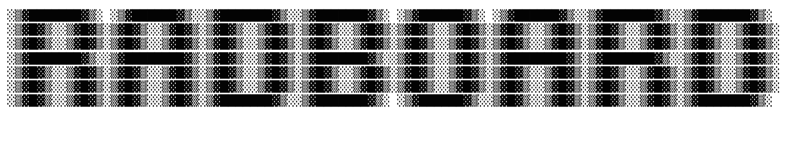

Radboard is an app that is built for musicians and producers for working in the studio.
The app is in early stages, as I am just trying to figure things out. This app is meant to be the default launcher, you dont have to have it as the default but it is reccomended. 

Radboard is designed for LineageOS 18.1 and the Amazon Echo Show 5" (First Gen). To learn about
modding your Amazon Echo Show 5" (First Gen) to include LineageOS, please read [this forum post.](https://xdaforums.com/t/unlock-root-twrp-unbrick-amazon-echo-show-5-1st-gen-2019-checkers.4762900/)
I am pretty sure that this can also work on tablets, but it may come with a lot of visual issues and bugs.
If you want to try running this on any other android device, make sure its running Android 11+.

To create projects better, and to create .radpack files for your chords, download the [Radboard Companion](https://github.com/RADCOLOUR/Radboard-Companion) app which is available for Windows, Mac and Linux.

This app requires an Internet Connection for updating, if you do not have internet enabled then you will have to 
download updates via .apk from here, which is kind of a hassle.

Visit [The Wiki](https://github.com/RADCOLOUR/Radboard/wiki) for more information on this project, including how to install and the Quick Start guide.

Join the [Discord](https://discord.gg/ZC8SVmEJEz)!

Please support me on Kofi if you can!

## Images

### Main Menu

### Chords Menu

### Notepad

### Chord Progressions

### Project Settings / Project Manager

### Settings 

### Project Selection Menu

